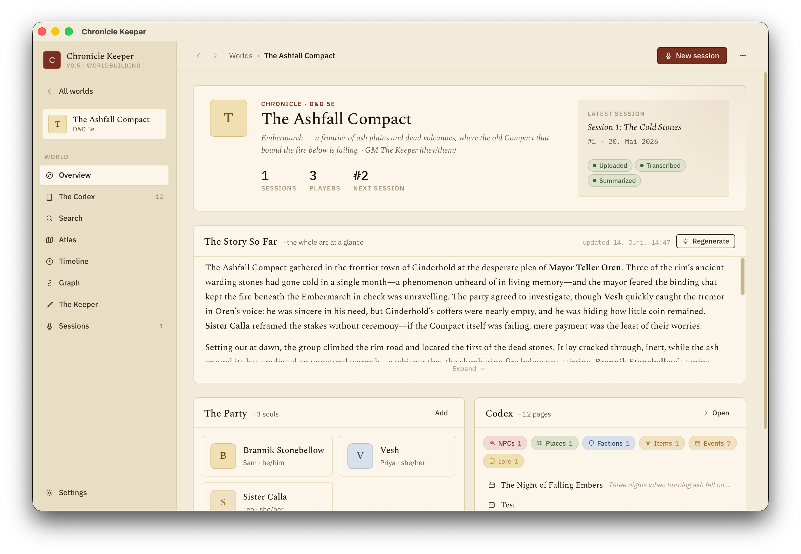
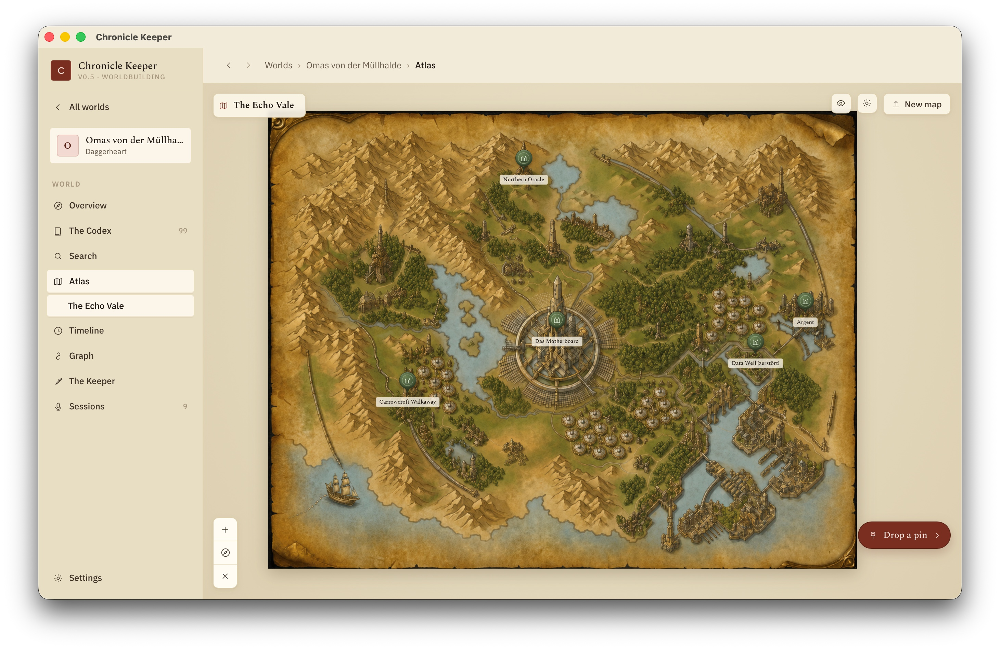
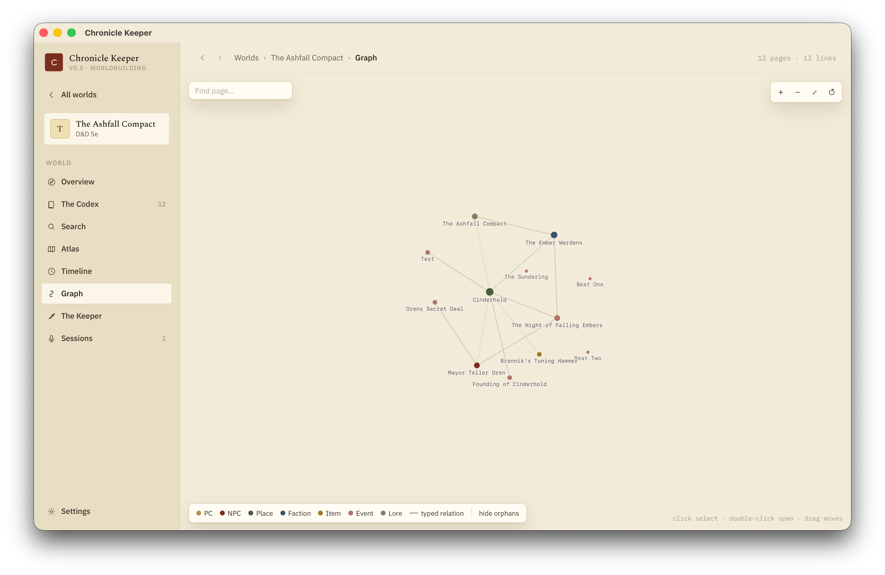
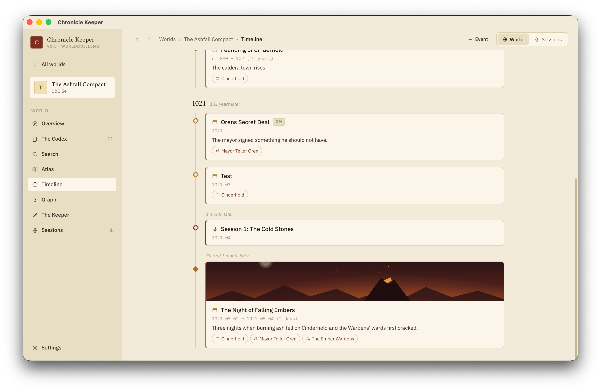
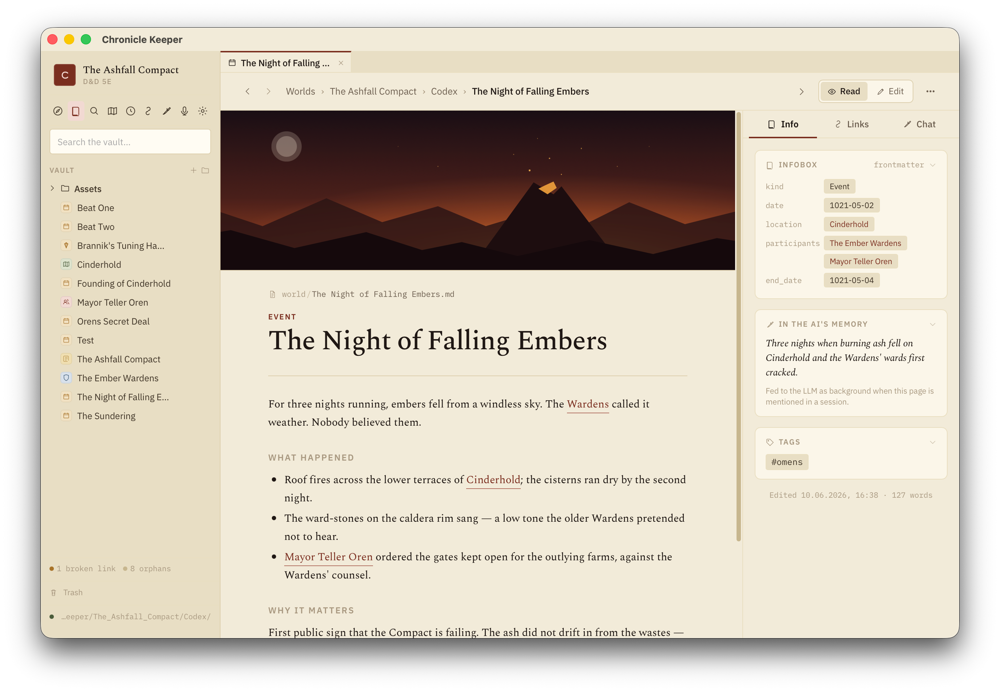
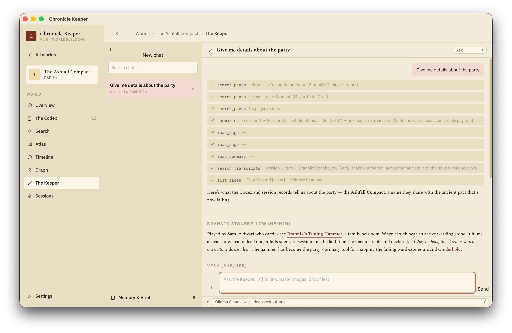
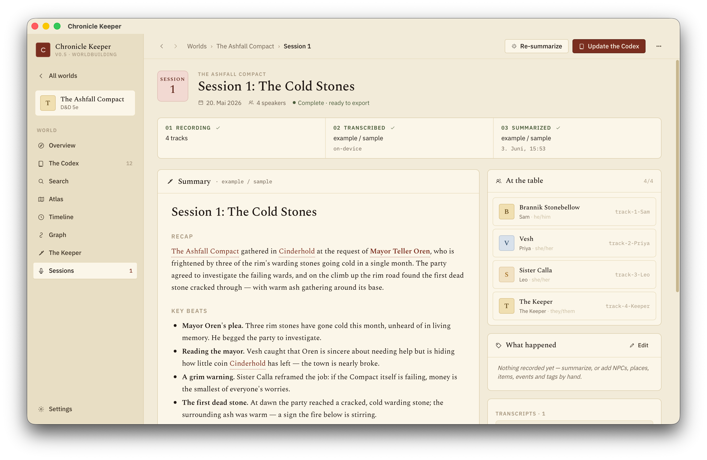
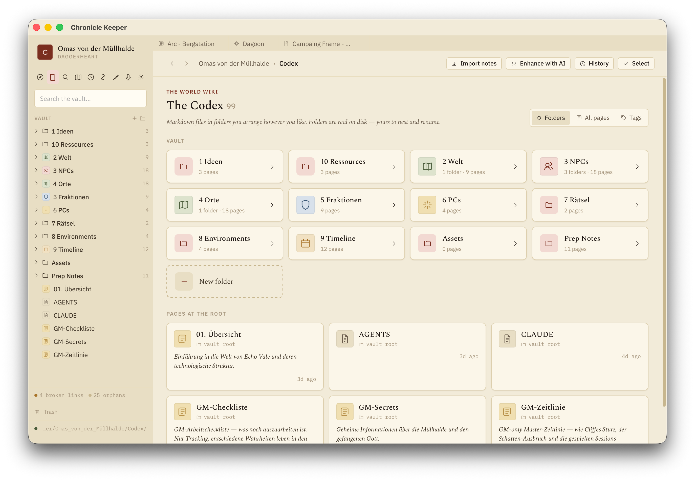
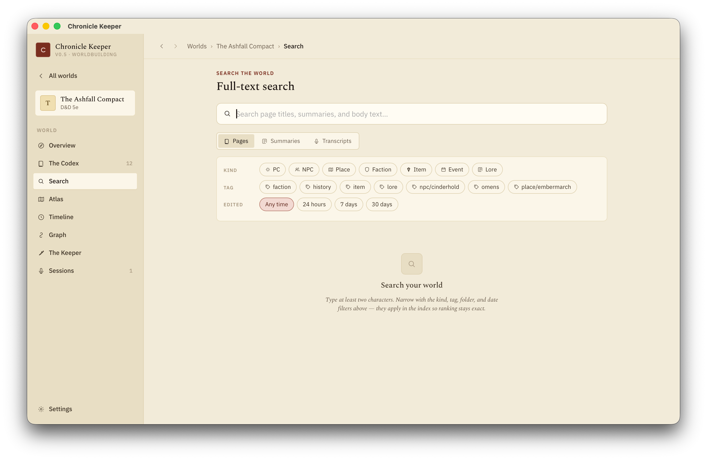

# Chronicle Keeper



> 🎉 **v1.0.0 — first full release.** Unsigned builds — see [install](#download--install).
> Bugs & feedback → [Issues](https://github.com/aronjanosch/chronicle-keeper/issues).

Chronicle Keeper is an AI-powered, local-first **worldbuilding workspace** for tabletop campaigns.
It turns raw session audio into structured notes — and then turns those notes into a living world
you can navigate, edit, and grow.

Drop in a [Craig Bot](https://craig.chat) recording, label who's who, and Chronicle Keeper
transcribes every track on-device, then uses your chosen LLM to produce clean, campaign-aware summaries.
Every NPC, place, faction and item becomes an editable wiki page — plain Markdown in your vault,
with an atlas, a timeline, a relationship graph, and an AI Keeper that keeps it all current.

- **Session notes → world.** Recordings become summaries, recaps, and a wiki the AI maintains.
- **Navigate your world.** Atlas (maps), timeline (in-world calendar), and a graph of how everything connects.
- **Local-first and private.** All transcription and processing runs on your device.
- **Files are truth.** Every page is plain Markdown — fully Obsidian-compatible, no lock-in.
- **Bring your own LLM.** Local [Ollama](https://ollama.com), Anthropic, and OpenAI-compatible providers.

📖 **[Read the docs →](https://aronjanosch.github.io/chronicle-keeper/)** — install guides, LLM
setup (Ollama + getting API keys), the full workflow, and FAQ.

## Features

**Worldbuilding**
- **Editable wiki pages.** Every NPC, place, faction, item, PC and lore entry is a Markdown page you read and write — files are truth, fully Obsidian-compatible.
- **The Keeper.** An AI assistant that reads your world and edits pages for you, with permissions, grounding, and undo. Talk to it by **voice** (push-to-talk dictation, transcribed on-device).
- **Keeper skills.** Reusable references the Keeper pulls on demand — system rules, house rules, prep workflows — and can **write itself** ("save that as a skill"); manage them in Settings.
- **Foundry VTT bridge.** Read live actors and scenes, look up compendiums, post to chat, and stat an NPC from a page straight into your running [Foundry](https://foundryvtt.com) game.
- **Web reference.** Ask-first web search & fetch for real-world naming, mythology and history — kept separate from your canon.
- **Atlas.** Maps with pins for your places.
- **Timeline.** Dated pages laid out on your world's own in-world calendar (custom months/eras).
- **Graph.** A force-directed view of how characters, factions and places link together.
- **Multiple worlds.** Keep separate campaigns/settings side by side, each a self-contained portable folder.
- **Backlinks, tags & queries.** Wikilinks, typed relations, broken-link diagnostics, and dataview-lite queries.
- **Import existing notes.** Bring a folder of notes and let the app distill them into wiki pages.

**Session notes**
- **On-device transcription (Parakeet native ASR).** Fast per-speaker transcripts from Craig ZIP tracks, 25 languages.
- **LLM-powered summaries.** Readable session notes with your chosen prompt template and provider.
- **Story-so-far recaps.** Campaign continuity recaps from session history.
- **Update-the-Codex.** Turn a session into proposed, grounded edits to your world pages.
- **Prompt template library.** Built-in prompts or your own summary styles.
- **Markdown + Obsidian export.** Notes drop straight into your vault.

## Screenshots

<table>
  <tr>
    <td width="50%"><br/><sub><b>Atlas</b> — maps with pins for your places</sub></td>
    <td width="50%"><br/><sub><b>Graph</b> — how characters, factions & places connect</sub></td>
  </tr>
  <tr>
    <td width="50%"><br/><sub><b>Timeline</b> — dated pages on your world's calendar</sub></td>
    <td width="50%"><br/><sub><b>Pages</b> — editable Markdown, infobox, backlinks, AI memory</sub></td>
  </tr>
  <tr>
    <td width="50%"><br/><sub><b>The Keeper</b> — AI assistant that reads & edits your world</sub></td>
    <td width="50%"><br/><sub><b>Sessions</b> — record → transcribe → summarize → update the codex</sub></td>
  </tr>
  <tr>
    <td width="50%"><br/><sub><b>The Codex</b> — your world as a folder of wiki pages</sub></td>
    <td width="50%"><br/><sub><b>Search</b> — full-text across pages, summaries & transcripts</sub></td>
  </tr>
</table>

## Download & install

Grab the installer for your OS
[**Releases**](https://github.com/aronjanosch/chronicle-keeper/releases) page.

> **Heads up:** the app isn't code-signed yet (signing is planned), so your OS will show a
> one-time "unknown developer" warning on first launch.

**macOS** (`.dmg`)
1. Open the `.dmg` and drag **Chronicle Keeper** into Applications.
2. First launch: **right-click the app → Open → Open** (a plain double-click is blocked).
   Or allow it under **System Settings → Privacy & Security → Open Anyway**.
3. Still stuck? In Terminal: `xattr -dr com.apple.quarantine "/Applications/Chronicle Keeper.app"`

**Windows** (`.msi` or `.exe`)
1. Run the installer.
2. If SmartScreen says *"Windows protected your PC"*, click **More info → Run anyway**.

**Linux** (`.AppImage` or `.deb`)
- AppImage: `chmod +x Chronicle*.AppImage` then run it.
- Debian/Ubuntu: `sudo dpkg -i chronicle-keeper_*.deb`

On first transcription the speech model (Parakeet TDT v3) downloads once.

## Set up your LLM

Open **Settings** and pick one:

- **Local (free):** run [Ollama](https://ollama.com) — `ollama serve && ollama pull gemma4:e2b`.
  On a 16&nbsp;GB+ machine, `gemma4:e4b` gives noticeably better summaries. The app auto-sizes the
  context to your full session, so local summaries are complete but take a few minutes.
- **Cloud:** paste an Anthropic or any OpenAI-compatible API key. Keys stay on your machine. Faster, pay per use.

See the [LLM setup guide](https://aronjanosch.github.io/chronicle-keeper/docs/llm-setup.html) for model recommendations and tuning.

## How it works

```
Upload Craig ZIP → label speakers → transcribe on-device → summarize (your LLM)
        ↓
   world pages (NPCs, places, factions…) → atlas · timeline · graph · the Keeper
```

Your world is one self-contained folder of Markdown files. Everything runs on-device and
offline-capable; your recordings and notes never leave your machine (unless you pick a cloud LLM,
which only ever sees the transcript text you send it).

## Build from source

You'll need [Rust](https://rustup.rs) and
[Tauri](https://tauri.app)
```bash
cargo tauri dev                          # build + run the desktop app
cargo tauri build                        # build installers for your OS
cargo run -p ck-core --bin ck-serve      # core API only, no window (http://127.0.0.1:8000)
RUST_LOG=debug cargo run -p ck-core --bin ck-serve   # verbose logs
```
Contributions welcome — see [`CONTRIBUTING.md`](CONTRIBUTING.md).

## License

[MIT](LICENSE).

Build with ❤️ from germany
